# Web mapping with Cesium (and Mapbox)

## Table of Contents

<!-- TOC -->

- [Web mapping with Cesium (and Mapbox)](#web-mapping-with-cesium-and-mapbox)
    - [Table of Contents](#table-of-contents)
    - [Overview](#overview)
        - [Final project theme](#final-project-theme)
        - [Lesson data](#lesson-data)
    - [Cesium](#cesium)
        - [Uploading data](#uploading-data)
        - [Create Stories](#create-stories)
        - [Sharing your Story's presentation](#sharing-your-storys-presentation)
        - [Basic HTML](#basic-html)
    - [Addendum: Mapbox](#addendum-mapbox)
        - [Data files](#data-files)
        - [The Mapbox platform](#the-mapbox-platform)
        - [Vector tiles](#vector-tiles)
        - [Create Mapbox account](#create-mapbox-account)
        - [Creating a base map with Mapbox Studio](#creating-a-base-map-with-mapbox-studio)
        - [Create New Style](#create-new-style)
        - [Sharing your map](#sharing-your-map)
        - [Adding other tilesets to your Mapbox map](#adding-other-tilesets-to-your-mapbox-map)
        - [GeoJSON format](#geojson-format)

<!-- /TOC -->

## Overview

In recent years, browsers have evolved to support complex graphics-driven applications thanks to progress in gaming technology. Advances in [WebGL (Web Graphics Library)](https://developer.mozilla.org/en-US/docs/Web/API/WebGL_API) and [GPUs (Graphics Processing Units)](https://en.wikipedia.org/wiki/Graphics_processing_unit) have revolutionized what we see in our browsers and how we interact with content. For example, you might notice that Google Maps is super smooth and fast when you pan and zoom – not to mention, its incredible 3D capabilities. Cesium.com (and Mapbox.com) harness this technology to offer unique platforms to build 2D and 3D web maps. 

In this lesson, we will explore adding point clouds to Cesium.com and creating a presentation on the platform. If you want to expand your web mapping horizons, we suggest diving into the addendum on Mapbox Studio. It is not a requirement for the module (because it requires more time and effort than one week offers), but it is a great way to learn more about web mapping and how to create custom, interactive maps.

 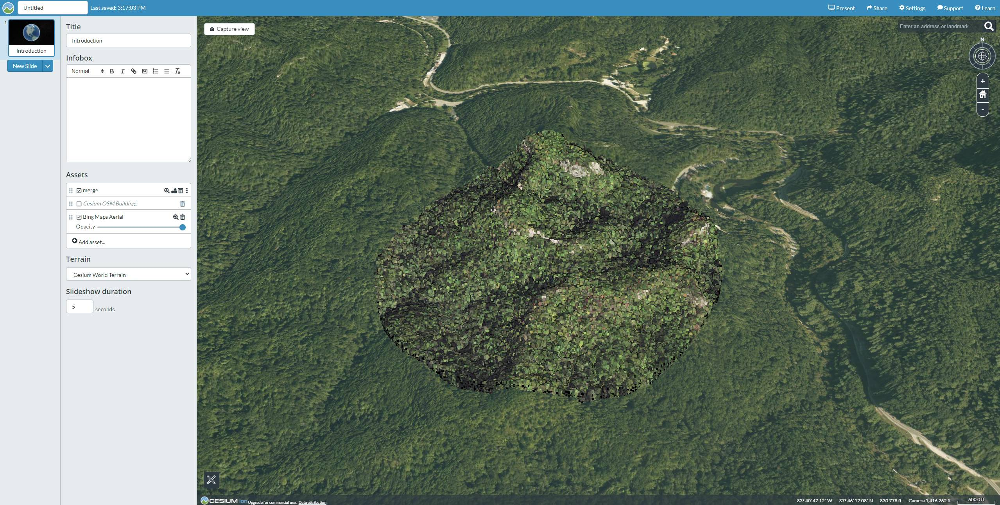 
*Cesium Ion Stories slide showing Natural Bridge SRP*

We'll wrap up the lesson by showing how to make interactive presentations on a web page that you'll host on your public GitHub Pages site.

### Final project theme

The map and web page made in this document will be the launchpad for your final project. Think about a theme or area of interest that you have been exploring in previous modules before beginning the lesson. This module's lab requires you to use two visualizations from previous labs to complete the assignment.

### Lesson data

Before we start, gather point clouds created from the *explore-lidar.ipynb* Notebook. You should find a LAS file called *projectName_merge_img.las* in the project's *lidar* folder. For testing, you can use the lesson's supplied data, [natbridge-las-point-cloud.zip](https://nyc3.digitaloceanspaces.com/astoria/geo409/data/natbridge-las-point-cloud.zip).

## Cesium

[Cesium](https://cesium.com/) is a web platform for 3D geospatial applications that started as an open-source project in 2012. The team was among the first to release a "Virtual Earth" with detailed global terrain data. Cesium created an intuitive web platform to present 3D assets like point clouds and models in a browser, which will exploit in this lesson. They have been a leading advocate for building real-world 3D models of earth and geospatial applications for the metaverse – in pursuit of a concept dubbed the "digital twin."

The platform offers a generous free tier. You can upload 5 GB of data for free. We'll upload LAS point clouds and create a presentation with them. However, you can upload many types of spatial data and 3D models to use in your presentations.

### Uploading data

Let's start by setting up our account. You can use your GitHub account to connect to this service. Visit [cesium.com/ion/](https://cesium.com/ion/signin/) and sign in: 

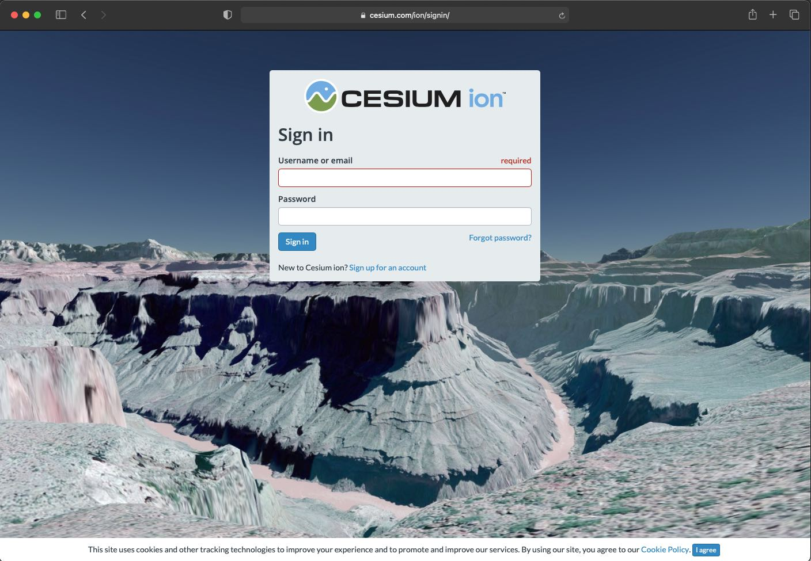   
*Sign in to Cesium Ion*

After signing in, visit the **My Assets** page and click the **Add data** button. 

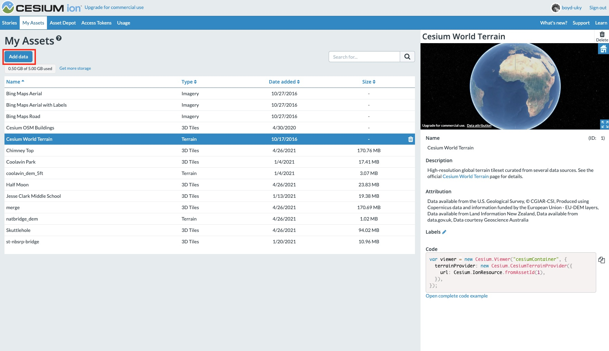   
*Visit My Assets page*

Select the file that you like to upload by clicking **Add files...**

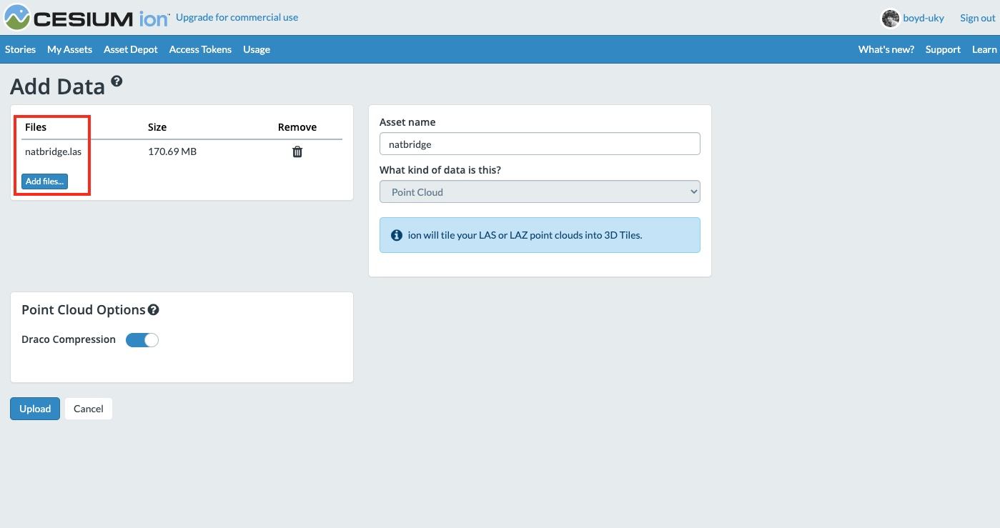   
*Add files...*

After the file uploads, Cesium ion will convert the file to 3D tiles, a format that allows for rapid display of a tremendous amount of detail in a browser. After the tiling is done, you should see a preview of your tileset over an aerial image of its location.

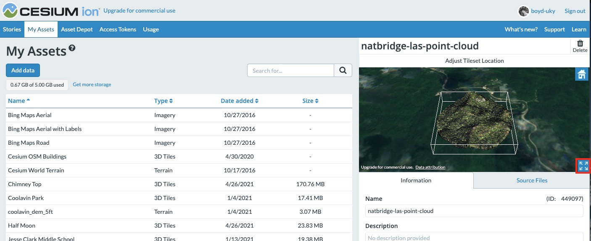   
*Preview of 3D tileset*

Here, you can change the name and description of your tileset. Click the enlarge icon to preview it in detail. Your mouse can zoom and pan. Keypress `CTRL + CLICK`  to rotate the view.

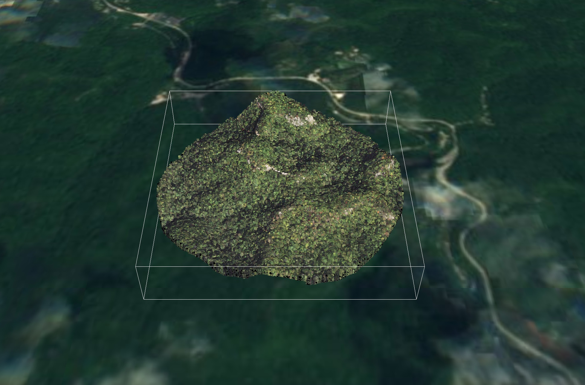   
*Enlarge 3D tileset*

Because KyFromAbove's point clouds use feet for the z unit, the 3D tileset in Cesium floats above the surface. You can adjust the height of the tileset by clicking the **Adjust Tileset Location** above the preview.

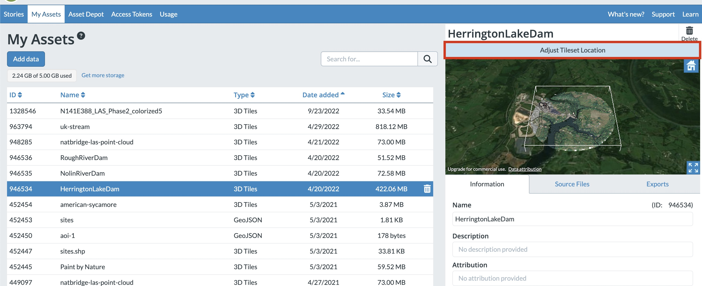   
*Adjust Tileset Location*

If you notice significant vertical displacement, you have a few ways to correct the problem.

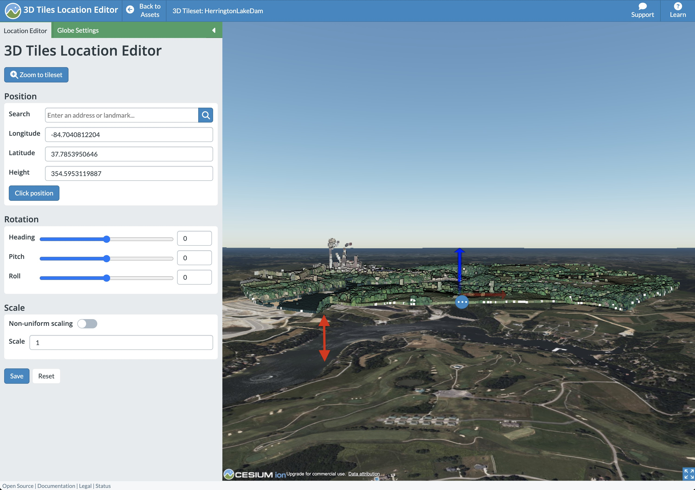   
*Note the vertical displacement*

You can click the **Non-uniform scaling** toggle and change the Z scale to 0.3048. This will scale the Z axis by 0.3048, which is the conversion factor from feet to meters. However, this might put the tileset too close to the ground and obscure the point cloud. Instead, grab the Z axis handle (the blue axis in the below image) and drag it up or down to adjust the height of the tileset.

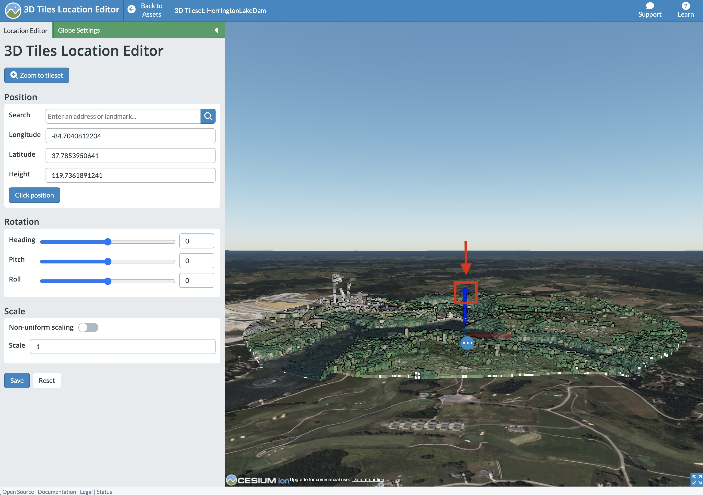   
*Change only the Z axis*

Make sure the tileset is resting just above the surface. Ok, we have a tileset that we can explore in the browser and share with the world. Let's create a story.

### Create Stories

Cesium ion Stories allows you to create interactive 3D presentations easily. It has been called the "PowerPoint for point clouds." The design process is similar to PowerPoint; you create slides with custom views of 3D scenes that include annotations, text, and images. The [tutorial](https://cesium.com/docs/tutorials/stories-introduction/) shows you how to create a slideshow using Melbourne, Australia as an example. Take a Vaca! and return here to continue. 

Let's create a new story. In the upper-left corner of the web page, find and click **Stories > New story**. Search for the location where you would like to start.

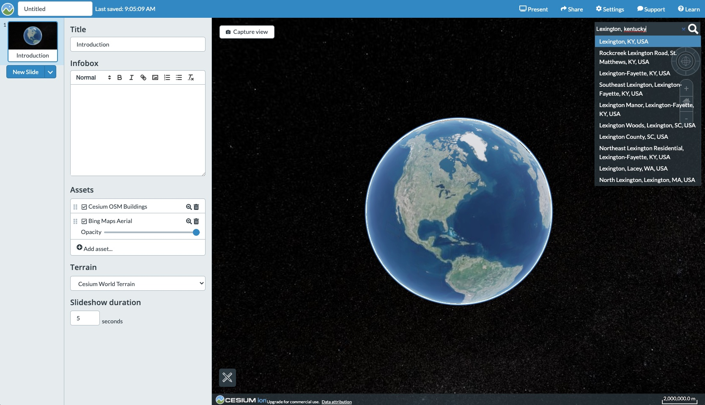   
*Create a new story*

Cesium ion will zoom to that location and show buildings and world imagery, and terrain by default when a location is found. Find a view where you would like to start. Click **Capture view** to set the view. Populate the slide with text, images, title, etc.

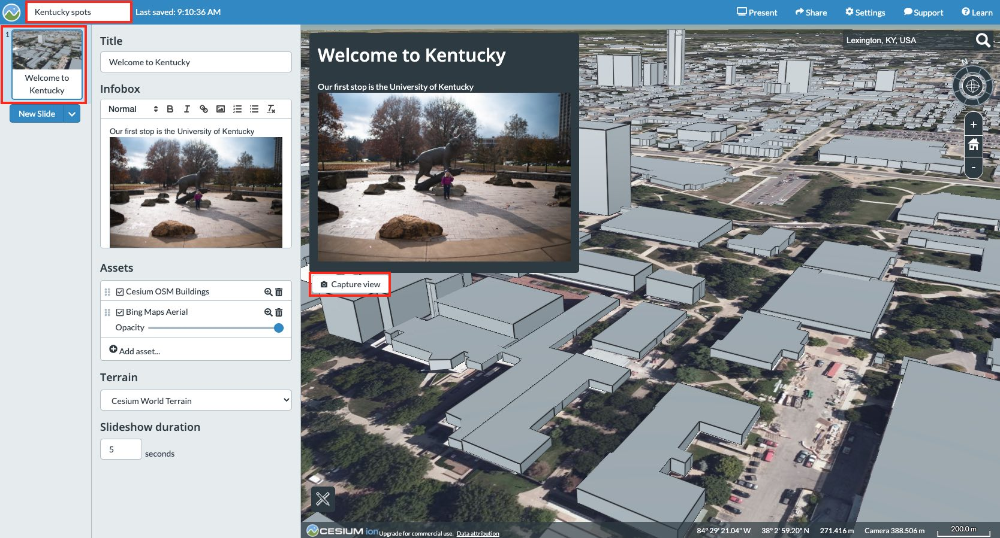   
*Set the first slide*

After you set all of the slide's details, click on **New slide**. To add a point cloud that you have colorized, click **Add asset** and find an uploaded tileset to add to the scene. In the list of assets, find the layer and its tools. The zoom icon will fly the scene to the tilesets location. Zoom, pan, and rotate the scene to a desirable view.

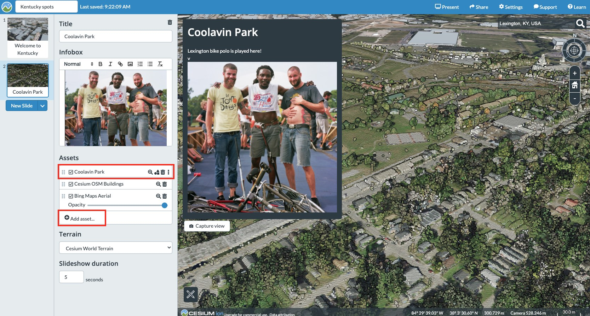   
*Add a second slide*

Add the slide's Infobox content and click **Capture view** to set the slide. Keep adding slides to fill out your story. If you find that a point cloud floats above the terrain similar to when we imported the point cloud, we can adjust the tileset's position in the presentation. Click the menu icon for the layer.

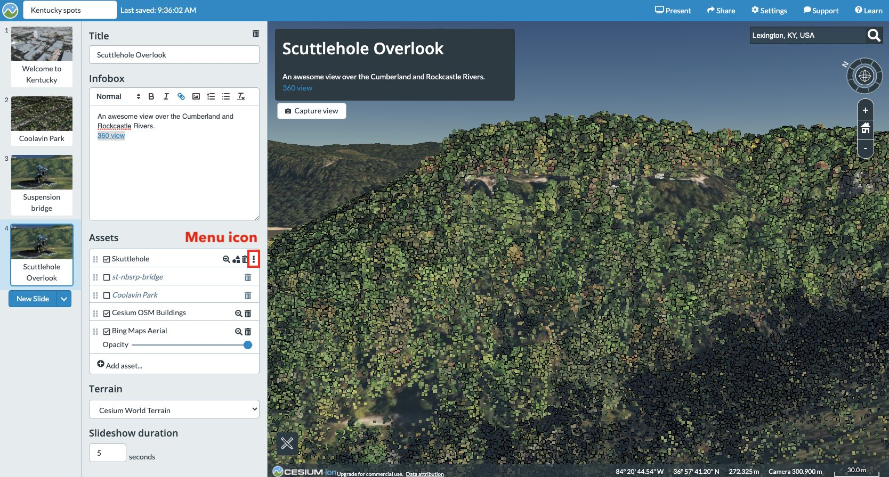   
*Access the tileset's menu to adjust position*

A 3D cursor should appear at the center of the tileset. Select the blue axis to move the tileset up or down. Find the least amount of change that appears to clamp the tileset to the terrain while still showing the point cloud.

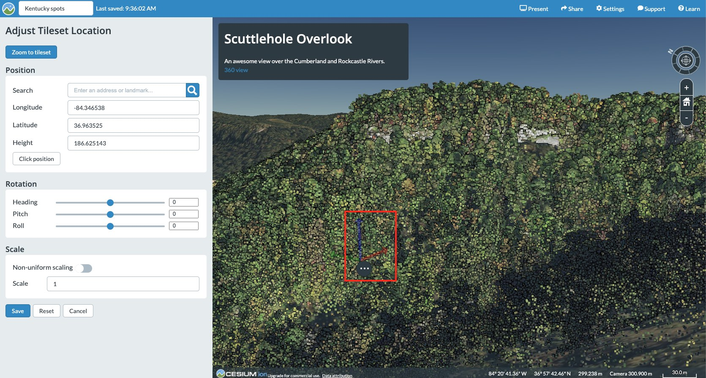   
*Adjust tileset's position*

Click **Save** to complete adjustment. When you have completed your adding your slides, you are ready for the publishing the presentation. 

<!-- In the Cesium Ion main menu, click on **Present**. Cesium ion will launch a window in the browser where you select a slide to visit. 
Cesium ion will fly you to that location.

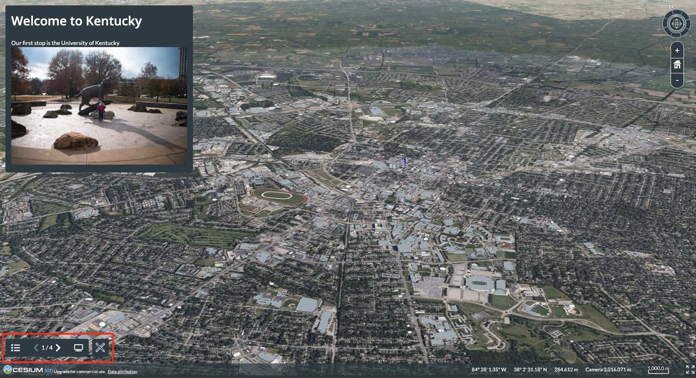   
*Presentation and measurement controls* -->

### Sharing your Story's presentation

Click the **Share** button in the Cesium ion menu. Enable sharing by toggling the switch to **on**. 

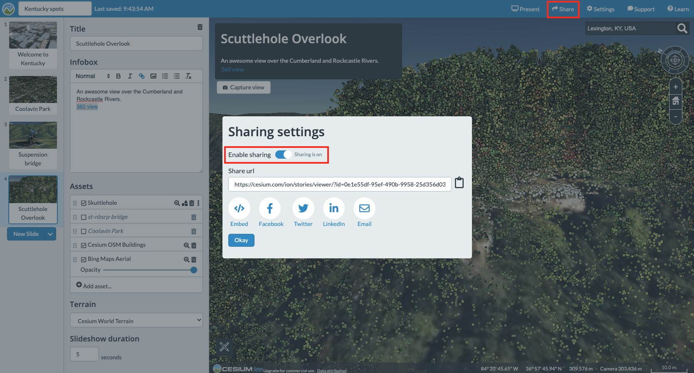   
*Sharing the presentation*

You have a couple of sharing options; choose **Embed**. Copy the code and paste it into a Markdown document. 

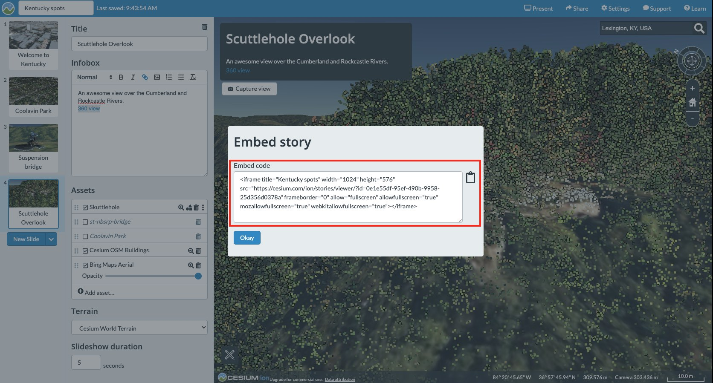   
*Copy embed code*

Save that code for the next section.

### Basic HTML

[HTML](https://www.w3schools.com/html/default.asp) (hypertext markup language) is the markup language used to create web pages. HTML is not a programming language, but it is a powerful tool for creating web pages. Like Python statements we used earlier in class, it is a text-based language – however, its instructions tell a browser what to render on the screen. 

HTML is a markup language (like Markdown but more powerful), which means that it uses tags to define [elements](https://www.w3schools.com/html/html_elements.asp) within a document. HTML tags normally come in pairs like `<p>` and `</p>`, the first is the opening tag, the second is the closing tag. The closing tag is the same as the opening tag, except that it includes a forward slash before the tag name. The content of the element is placed between the opening and closing tags as this example showing two paragraphs:

```html
<p>First paragraph: Hello World!</p>
<p>Second paragraph: Geography y'all!</p>
```

The above code will render as (note that the browser will add a line break between the two paragraphs):

<p>First paragraph: Hello World!</p>
<p>Second paragraph: Geography y'all!</p>

Some elements use self-closing tags, which do not have a closing tag. The `` tag is an example of a self-closing tag, which embeds an image in an HTML page. The `src` attribute specifies the path to the image to be displayed. The `alt` attribute specifies an alternate text for the image, if the image for some reason cannot be displayed. The `width` and `height` attributes specify the width and height of the image. The example below shows an image that is 200 pixels wide:

```html

```

Which renders as:


Carefully inspect the `src` attribute. It is a relative path to the image. The image is in a subdirectory (a directory in the same directory as this document) called *lesson-map*. So, the path is `lesson-map/logo-color-400px.png`. If the image were in the same directory as the HTML file, the path would be just the image name. If the image were in a parent directory, the path would be `../image-name.jpg` – the `../` means "go up one directory". Remember: All path names are case sensitive.

Absolute paths are used to access remote resources. An absolute path is a complete URL that specifies the location of a resource on the web. The example below shows an image that is 200 pixels wide:

```html

```

Which renders as:


Ok, let's move on to adding the presentation to a web page. First, launch VS Code and open this repository as a folder. Find the *lesson-map/index.html* in the left Contents panel. This is the web page template that we will use to add the presentation and other content.

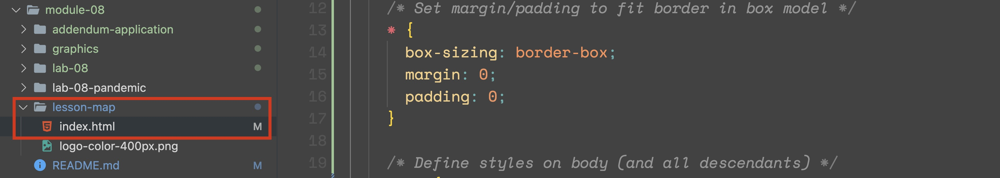   
*Find the web page template*

Make sure that you have the Live Server VS Code Extension installed. This will give you a local web server to test your web pages. 

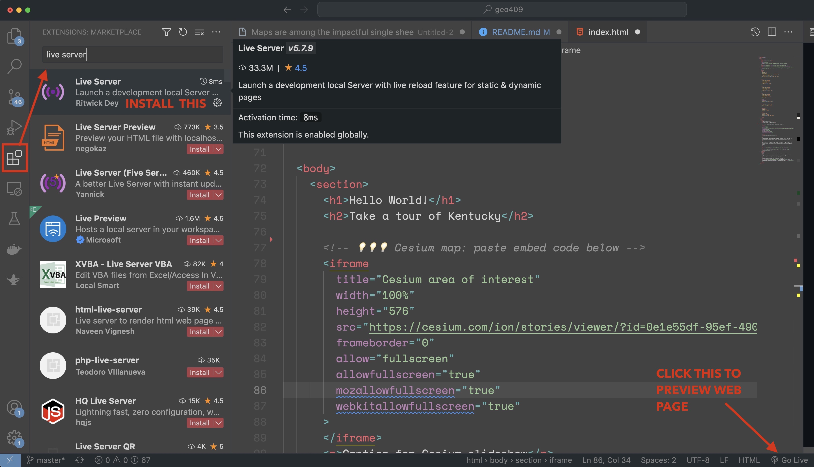   
*Install the Live Server Extension and then Go Live*

Click on the **Go Live** button in the bottom right corner of the VS Code window. This will launch a browser window with the web page template. You should see a web page that looks like this:

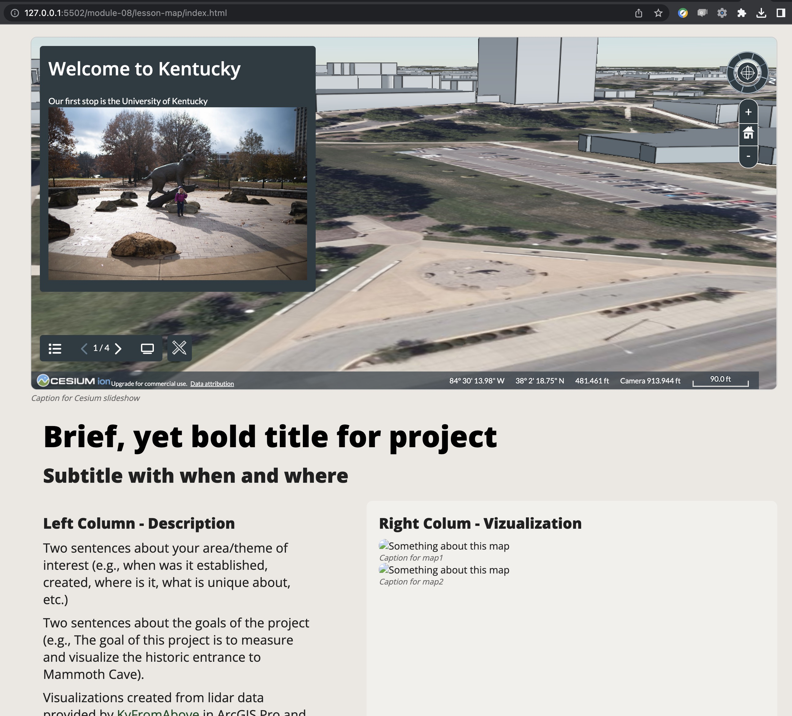   
*Previewing web page on your local computer*

It's now time to add content to this page. Open the file and let's inspect the code. Let's start with the title. Find the `<title>` tag in the `<head>` section of the HTML document. Replace the text between the `<title>` tags with the title of your presentation. 

```html
<!DOCTYPE html>
<html>

<head>
  <meta charset="utf-8" />
  <title>Presentation</title>
  <meta name="viewport" content="initial-scale=1,maximum-scale=1,user-scalable=no" />
```

Next, we can decide if we want to change fonts used in the document. Find the last `<link>` tag in the `<head>` section of the HTML document. Currently, the document uses Open Sans from Google Fonts, but you can change it to any font you like. We suggest starting with [Google Fonts](https://fonts.google.com/).

```html
<link href="https://fonts.googleapis.com/css2?family=Open+Sans:wght@400;800&display=swap" rel="stylesheet" />
```

The next section defines the styles used in our document using [Cascading Style Sheets](https://www.w3schools.com/css/default.asp). Find the `<style>` tag in the `<head>` section of the HTML document. We can style native elements by applying rules to an element's name. The CSS code is enclosed in curly braces and is made up of property-value pairs. The property is followed by a colon and then the value. The property-value pairs are separated by semicolons. The example below shows the CSS code for the `<body>` element:

```css
/* Define styles on body (and all descendants) */
body {
  margin: 0;
  padding: 0;
  font-family: "Open Sans", sans-serif;
  font-weight: 400;
  color: rgb(32, 32, 32);
  background-color: rgb(236, 232, 228);
}
```

The background color of the body is set to `rgb(236, 232, 228)` using RGB (red, green, and blue) values. Font color is set to `rgb(32, 32, 32)` and the font family is set to "Open Sans". You can use [this color picker](https://www.w3schools.com/colors/colors_picker.asp) to find a color you like.  All elements in the document will use these styles, unless you override them with more specific styles. The `body` element is the root element of the document – all other elements are descendants of the `body` element and adopt these styles by default.

If you keep skimming through the CSS code, you'll find rules that start with a period. This defines a class name and style that can be applied to any element in the document. For example, the class `caption` has a smaller font size, a lighter font weight, and a lighter color:

```css
.caption {
  font-size: 0.8rem;
  font-weight: 400;
  font-style: italic;
  margin: 0;
  padding: 0;
  color: rgb(100, 100, 100);
}
```

To use this class on an HTML element, we supply a class attribute to the element. The class attribute is preceded by the word `class` and is enclosed in double quotes. The class attribute can be used on multiple elements in the document. The example below shows the class attribute being used on a `<p>` element:

```html
<p class="caption">Caption for Cesium slideshow</p>
```

The class name is also called a *selector* because it can be used to identify and select elements in the document. 

Experimenting with CSS is a great way to learn how to style your web pages. You can use the [W3Schools CSS Tutorial](https://www.w3schools.com/css/default.asp) to learn more about CSS. If you make a change to the CSS code, you'll need to save the file and refresh the browser window to see the changes.

Let's now add the Cesium map to the web page and other content to the page. Find the `<body>` tag in the HTML document and scroll down to the commented area, e.g., `<!-- I'm a comment in HTML -->`. The code should look like this:

```html
<body>
  <section>
    <!-- 💡💡💡 Cesium map: paste embed code below -->
    <iframe title="Cesium area of interest" width="100%" height="576"
      src="https://cesium.com/ion/stories/viewer/?id=0e1e55df-95ef-490b-9958-25d356d0378a" frameborder="0"
      allow="fullscreen" allowfullscreen="true" mozallowfullscreen="true" webkitallowfullscreen="true">
    </iframe>
    <!-- 💡💡💡 Cesium map: paste embed code above -->
    <p class="caption">Caption for Cesium slideshow</p>
    <div class="title">
      <h1>Brief, yet bold title for project</h1>
      <h2>Subtitle with when and where</h2>
    </div>
```

First, replace the code between the 💡💡💡 comments with the embed code you copied from Cesium ion. The embed code creates an iframe element that displays the Cesium map.

So, what is an iframe, a.k.a., inline frame? It's defined by the `iframe` tag that allows you to embed another web page into your web page. The start tag is `<iframe>` and the end tag is `</iframe>` and together they define an inline frame element on the page. 

An [iframe](https://www.w3schools.com/tags/tag_iframe.ASP) has attributes used to control it's appearance and behavior. The size of the rectangular area is defined by the `width` and `height` attributes. The `src` attribute is the URL of the web page to display. The `allowfullscreen` attribute allows the user to view the presentation in full screen mode. The `frameborder` attribute is the width of the border around the iframe. The `title` attribute is the title of the presentation.

After adding your code, save this file in VS Code and hop over to the browser. Do you see your point cloud powerpoint from Cesium Ion? If so, awesome! Add a title and subtitle inside the `h1` and `h2` tags, respectively. Let's now add our final content to the page. 

Scroll down to `<div>` tag with the class name, `left-column`. Find that tag's closing `</div>` tag. That's the left column of the two-column layout. The right column is defined by the `<div>` tag with the class name, `right-column`. Here is where you add content in a two-column layout.

```html
<div class="container">
  <div class="left-column">
    <h3>Left Column - Description</h3>
    <p>
      Paragraph about your area/theme of interest (e.g., when was it
      established, created, where is it, what is unique about, etc.)
    </p>

    <p>
      Paragraph about the goals of the project (e.g., The goal of this
      project is to measure and visualize the historic entrance to Mammoth
      Cave).
    </p>
    <p>
      Visualizations created from lidar data provided by
      <a href="https://kyfromabove.ky.gov/">KyFromAbove</a> using ArcGIS Pro, ArcPy, Blender, etc... Additional sources of data from
      <a href="https://...">name of source</a>, April, 2023.
    </p>
    <p>
      Page and visualizations created by B for GEO 409, Department of
      Geography, University of Kentucky. Spring 2023.
    </p>
  </div>
  <div class="right-column">
    <h3>Right Colum - Vizualization </h3>
    
    <p class="caption">Caption for map1</p>
    
    <p class="caption">Caption for map2</p>
  </div>
</div>
```

Customize this page with your own content. You will need to add your map images to this folder and link them in the `img` tag by supplying the `src` attribute with the image name. Make sure the image file names do not have spaces in them. If you need help with your design, save your work in this repository, commit the changes, and push the changes to GitHub. Then, let me know and we can work on it together. Behold the power of collaboration!

If you want to take web mapping to another level, continue with the Addendum below. Otherwise, let's move on to the lab.


## Addendum: Mapbox

This addendum will show how to add raster and vector layers produced from previous lessons and use them on Mapbox's web map platform. 

Mapbox uses [OpenStreetMap (OSM)](https://www.openstreetmap.org) data, an incredibly comprehensive global, open-source dataset but incomplete in many ways. We might want to map features not found on OpenStreetMap. Being able to create data that can be hosted in third-party web  map platforms will be a handy skill.

In the first part of this addendum, we will add a raster layers to our Mapbox map. The raster layer can any one of any that you have produced in previous lessons. For this example, we'll use a shaded relief for Kentucky. In the image below, you see a 3D scene. Mapbox has incredible 3D capabilities, but we cannot use point clouds in Mapbox.

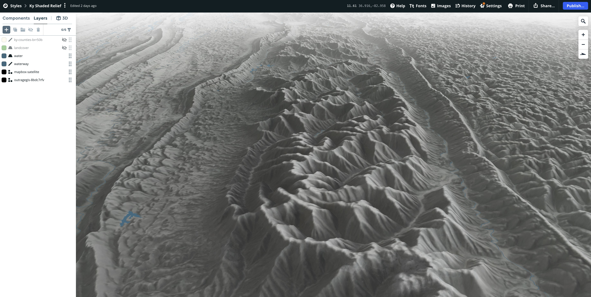    
*Shaded relief of Kentucky in Mapbox*


In second part of the addendum, we demonstrate how to make a site map for Natural Bridge, a popular arch in the Red River Gorge Geological Area in Kentucky. A **site map** is a large-scale scene with elevation contours around the arch. When we zoom out, we'll fade out the contours and show all 700+ arches in the United States. We'll can add pillars (a significant rock outcropping) to our map, too.

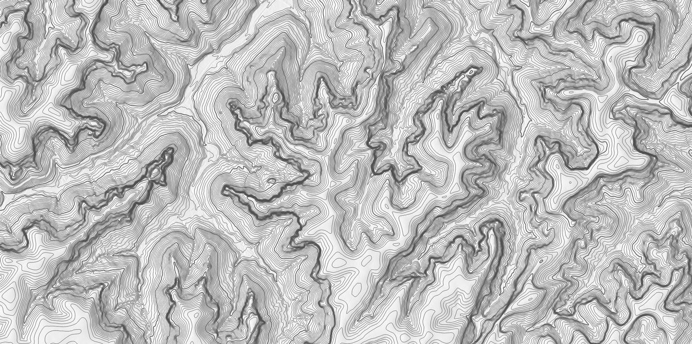 
*Elevation contours produced from lidar data*

### Data files

* GeoTIFF for the shaded relief of Kentucky: [ky-hillshade.tif](https://nyc3.digitaloceanspaces.com/astoria/geo409/data/ky-hillshade.tif)

* Any other raster layers you produced in previous lessons: [Making custom rasters for uploading to Mapbox](#add-custom-raster-layer)

* Point locations and map symbols for U.S. named arches and pillars: [arch-data-symbols.zip](https://nyc3.digitaloceanspaces.com/astoria/geo409/data/arch-data-symbols.zip).


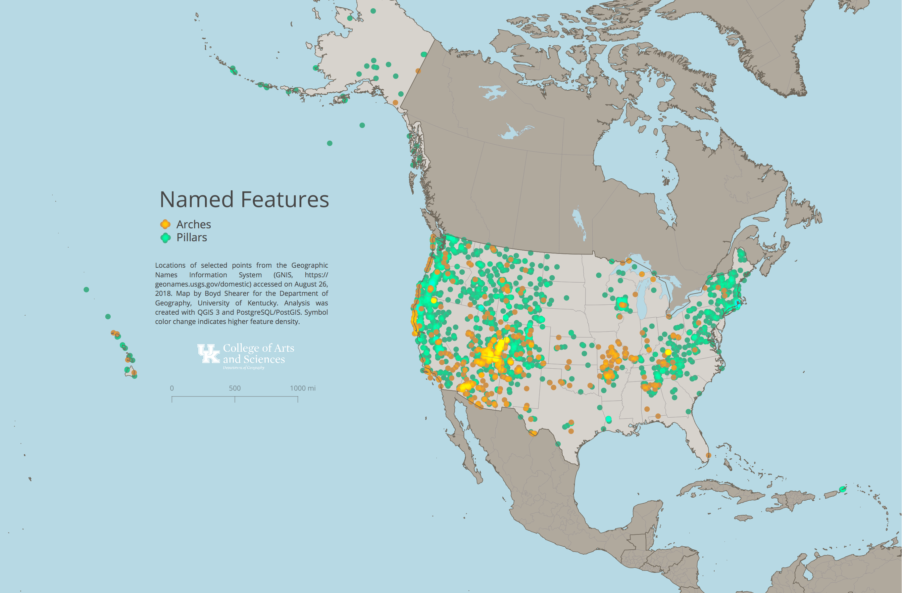 
*Named arches and pillars in the US*
* Elevation contours for Natural Bridge: [natbridge-contour_10ft.zip](https://nyc3.digitaloceanspaces.com/astoria/geo409/data/natbridge-contour_10ft.zip)

### The Mapbox platform

Probably the most well-known of Mapbox services is custom, beautiful map design completely in the browser. Using [OpenStreetMap (OSM)](https://www.openstreetmap.org) data for its base map layers, users can apply custom styles to global datasets, which are instantly rendered in vector tilesets. No more waiting to generate raster tilesets! (Their innovative [TileMill app](https://wiki.openstreetmap.org/wiki/TileMill) let cartographers build slippy maps with raster tilesets, but was discontinued in 2015.)

At the heart of Mapbox's advanced cartography is [Mapbox Studio](https://www.mapbox.com/mapbox-studio/), a browser editor that controls layer symbology and labeling based on attribute classification, zoom level, etc. You have hundreds of layers from OSM spanning the entire globe from which to use. You can add your own data, too; raster or vector layers can be added to your mapping project. Studio has been called the "Photoshop of online maps."

Studio is one component in the [Mapbox ecosystem](https://www.mapbox.com/help/how-mapbox-works-overview/). When you have created a cartographic masterpiece, you must publish the tileset as a map [Style](https://www.mapbox.com/help/studio-manual-styles/), a text document that defines the look of your map layers. These styles are shared among the community of mapmakers on Mapbox, and a curated set of designer styles is available to use. 

To publish a web map, we must customize an HTML document and use their JavaScript library, [Mapbox GL JS](https://www.mapbox.com/mapbox-gl-js/api/), to display our map. We will use this method to display a custom of our area of interest.

Have you ever used a map app on your mobile device? There's a good chance that the map was developed using Mapbox technology. If so, then you're helping Mapbox develop a real-time picture of how we travel and improve their base maps. Check out their [Telemetry Project](https://www.mapbox.com/telemetry/).

### Vector tiles

Supporting this revolution in web maps are vector tiles and WebGL, which is itself a product of [video gaming technology](https://en.wikipedia.org/wiki/OpenGL). Mapbox developed the [vector tile specification](https://www.mapbox.com/vector-tiles/specification/) in 2014 and made it an open standard. Expect to see more vector tiles in web maps, and it's a good time to start learning about them.

If you recall from our GIS data model, the vector data model uses geometries (point, line, and polygons) to encode real-world locations. Unlike raster data, vector data is highly compressible. When delivered over the internet to your browser, vector tiles are faster to load, so your map loads faster.

A *vector tileset* assembles a large set of features into a structured format containing geometry and metadata (like feature attributes). When you request a map of an area, only those features within your browser window are loaded. Your browser does the heavy lifting of drawing the features, but computers have become so powerful that this is an easy task. Compared to raster tilesets, these tilesets don't have stepped zoom levels. This is really smooth.

### Create Mapbox account

Mapbox is [free](https://www.mapbox.com/pricing/), and you only pay if your map becomes popular, i.e., a lot of map views are being requested. If you want private data, tilesets, and styles, or if you want to charge for the use of your map, you will need a commercial license. No worries, we have all the tools we need with the free plan!

Create your account via this link: https://www.mapbox.com/signup/

Before you signup, consider a good user name. You cannot change it. After your successful login, you should see:

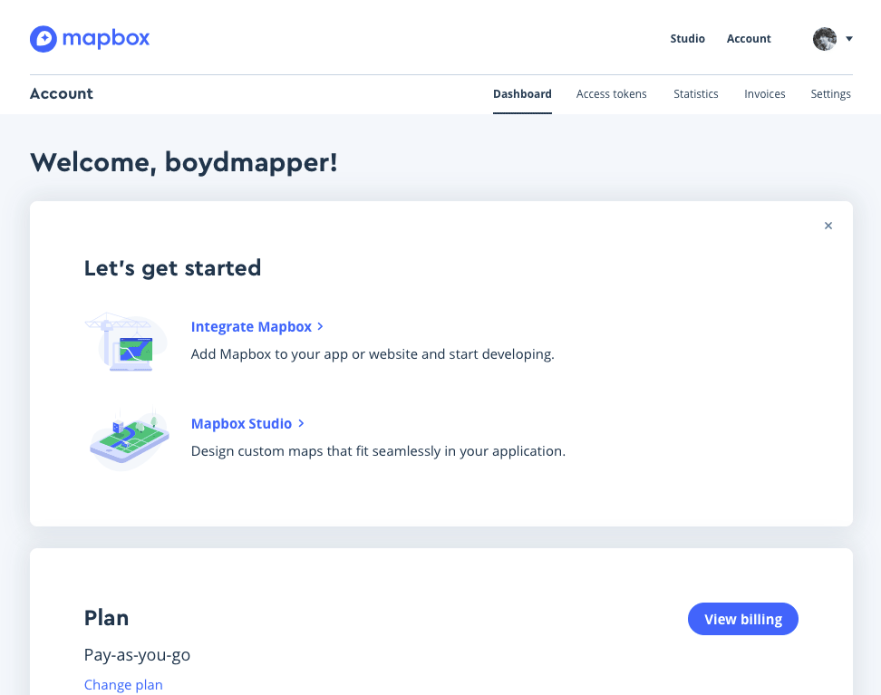 
*Welcome to Mapbox!*

How is it possible that we can access so much data for free? If you notice the [attribution requirement](https://www.mapbox.com/help/how-attribution-works/), we are using OpenStreetMap (in most cases). Mapbox's business model leverages open-source data (and its contributors) to develop a service that would be nearly impossible otherwise. They then develop software, web infrastructure, and thorough documentation to support (much) larger applications. Another way to look at this free service is that it gives aspiring cartographers access to learn the Mapbox ecosystem.


### Creating a base map with Mapbox Studio

Studio editor is the interface that we'll use to create our base map. Studio uses rule-based symbology where we can change the appearance of our features by zoom level and attributes. Maps are rendered 'real-time' and can be deployed via an HTML document hosted on our GitHub Pages using their JavaScript library.

#### Definitions

* **Dataset**: A dataset is an **editable** collection of GeoJSON features (a common web mapping format for vector map layers). Create, modify, and delete datasets in Mapbox Studio.

* **Tileset**: A tileset is a collection of raster or vector data broken up into a uniform grid of square tiles at 22 preset zoom levels. Mapbox has created a default set to start a project. Tilesets can be used as layers in Styles. They cannot be edited.

* **Style**: We might traditionally call these *maps*. A style uses tilesets as layers, defines how features in these layers should appear (at different zoom levels) and are modified in the Style editor. Once you get the look you desire, a style can be published, downloaded, and shared. Mapbox provides a basic collection of style templates and a curated set of designer styles.

#### Add custom raster layer

Let's add a custom raster layer to our Studio. We'll use the [ky-hillshade.tif](https://nyc3.digitaloceanspaces.com/astoria/geo409/data/ky-hillshade.tif), but you can use any raster layer that you can see in ArcGIS Pro (follow the next section in the lesson to do this). 

In Mapbox Studio, click on the **Tilesets** tab. Then click, **New Tileset** and upload the ky-hillshade.tif file.

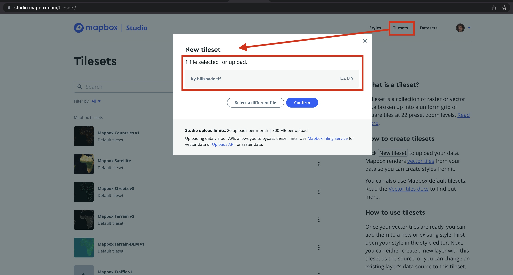 
*Add new tileset*

Click **Confirm** and let Mapbox finish creating the tileset. You should see a message when the processing is complete and your tileset is ready to be added to a new *Style*.


#### Exporting GeoTIFF rasters from ArcGIS Pro

For example, I want to use the custom shaded relief with vegetation symbolized for WKU's campus.

Raster layers should be in the [Web Mercator CRS](https://en.wikipedia.org/wiki/Web_Mercator) (EPSG: 3857) and in the GeoTiff (.tif) file format. An ArcGIS Layout can be exported as a GeoTIFF. Be careful not to make the file size too large since Mapbox has account limits (300 MB per file and 20 files uploaded per month).

If you have a raster layer in ArcGIS Pro displayed in a Map, change the **Map Properties > Coordinate System** to Web Mercator (search for EPSG: 3857). 

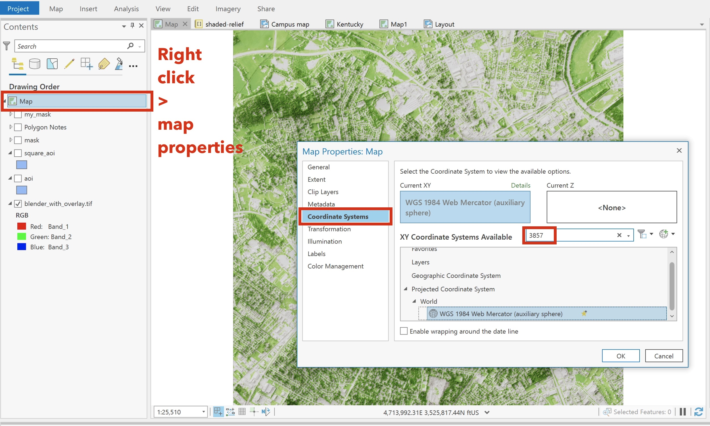 
*Project map to EPSG 3857*

Next, create a new Layout and place your map so that it fills the entire page. Click the **Share** tab and click **Export Map**. Select the TIFF  file type and enable Write GeoTIFF tags.

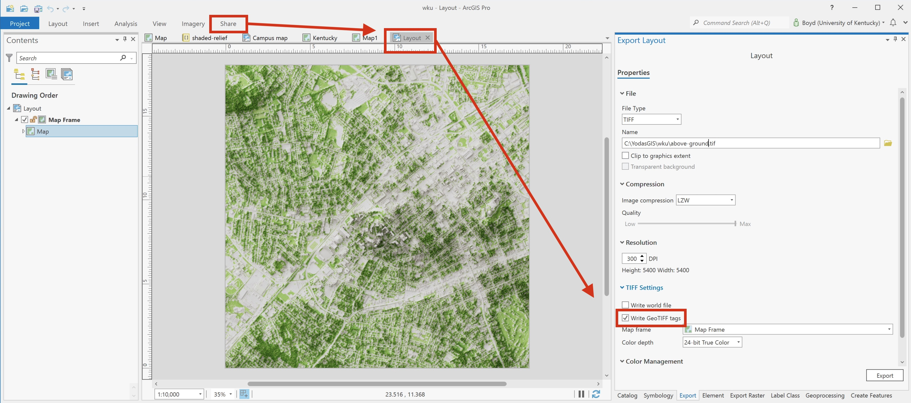 
*Exporting a GeoTIFF*

Export the Layout as a TIFF and locate it in your project folder. If your exported TIFF is larger than 300 MB, enable the setting for Image compression and re-export.

### Create New Style

After you have some custom tilesets, you can now add them to a new map, aka **Style**. Click on the **New Style** and select **Pick a template or upload a style**. You can select any style, but **Satellite** and **Outdoors** are good choices for our theme. Each lists the template tilesets that are used. We'll start with a **Blank** template and add a selection of tilesets. 

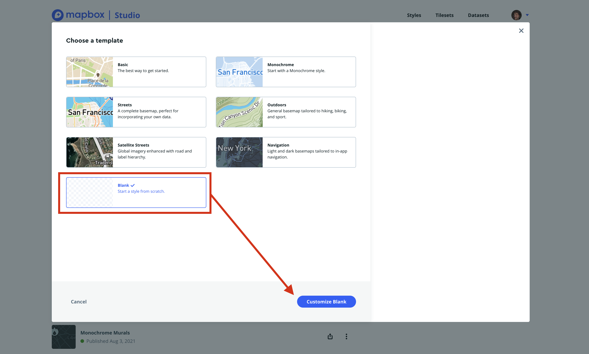 
*Add New Style from template*


After a style is selected, the Studio editor will launch. On the left side, you have layers. The right side has a command menu that tells you the current zoom level, map position, etc. But, it's blank!

Let's add a new layer. Click on the **Layers** tab and click **+** button and find the Source **Mapbox Satellite**. 

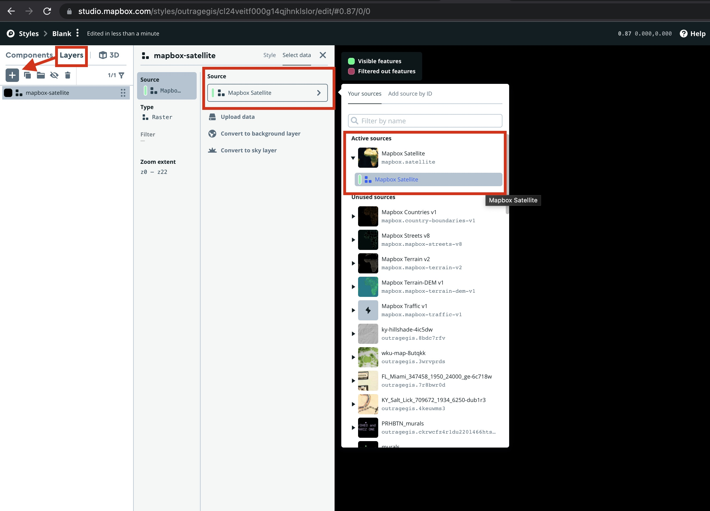 
*Add Mapbox satellite layer*

After the layer is shown in the left-hand list of layers, click the **Style** button to the styling options for this layer.

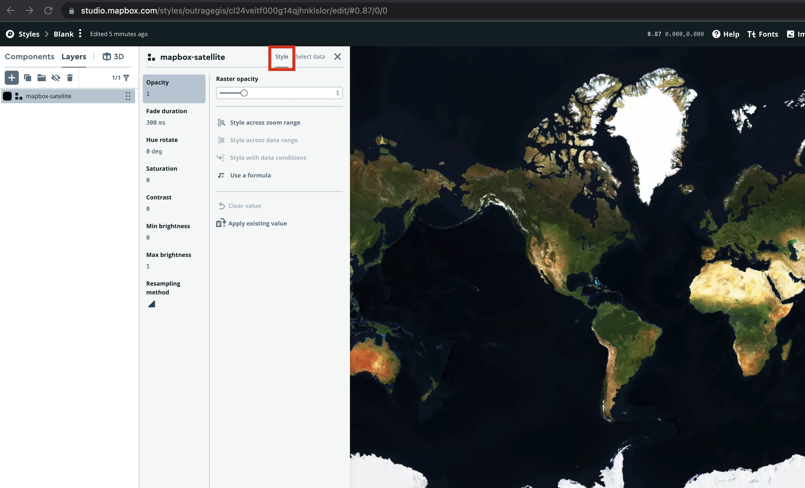 
*View symbology options*


Ok, let's center map on an AOI. Search for your location:

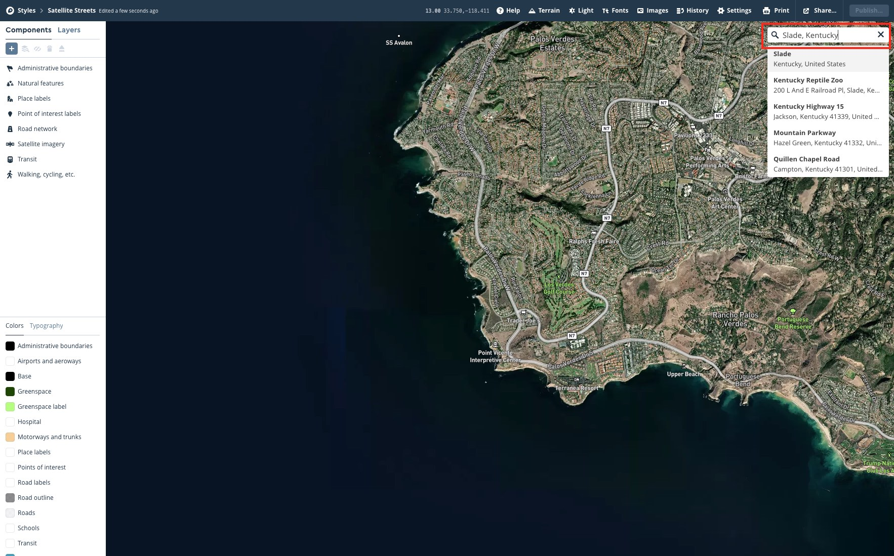 
*Use the search bar to jump to your area of interest*


Center your area of interest in your map view using the pan and zoom. When you have it centered, let's unlock and relock the **Default Position** in the **Map Position** properties:

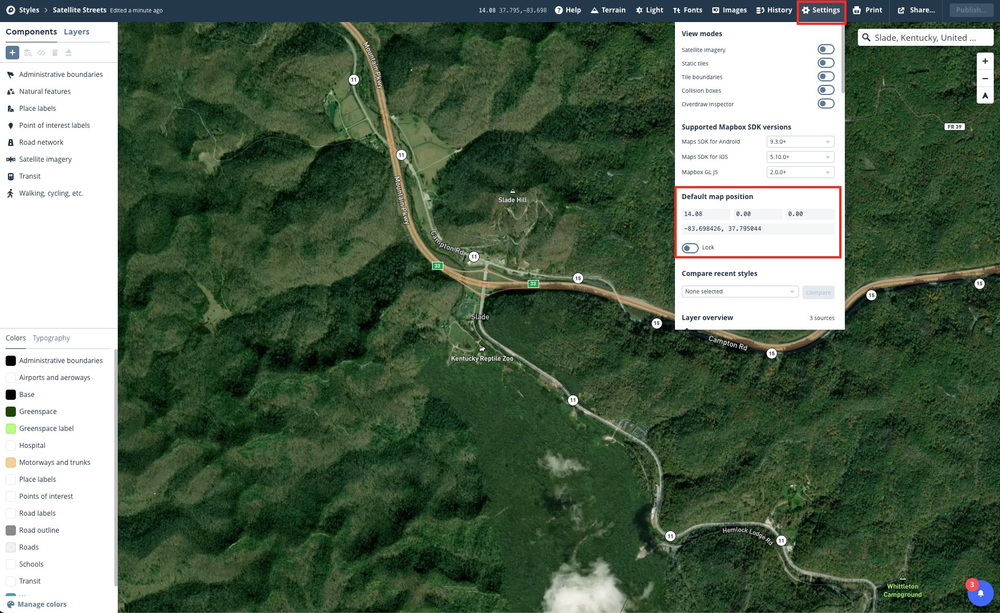 
*Fix your default map position*

Your map is now centered on your area of interest. No need to click **save** anywhere since it's always saved. Change the name of your style to represent your area of interest. In the upper-left corner, you'll see the template name, click it, and replace it.

#### View custom raster layer

Click on **Layer** button to add the custom tileset for Kentucky's shaded relief map. You can re-order the tilesets by dragging them in the layer panel, just like in ArcGIS. Put the hillshade at the bottom. 

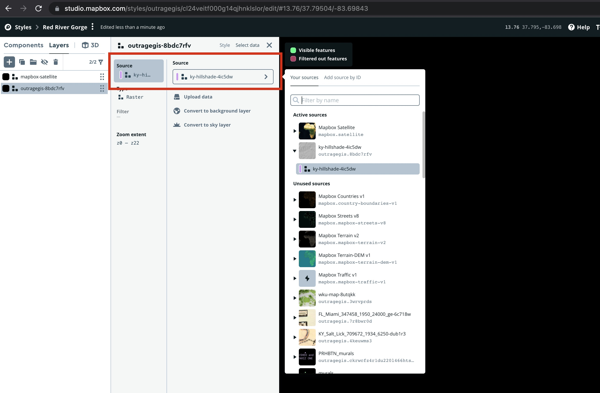 
*Add the custom raster layer and reorder layers*

Right now, the satellite image is opaque and we cannot see the custom raster layer. Let's make it transparent when we zoon into the map. Click the **mapbox-satellite** layer > **Opacity** > **Style across zoom range**.

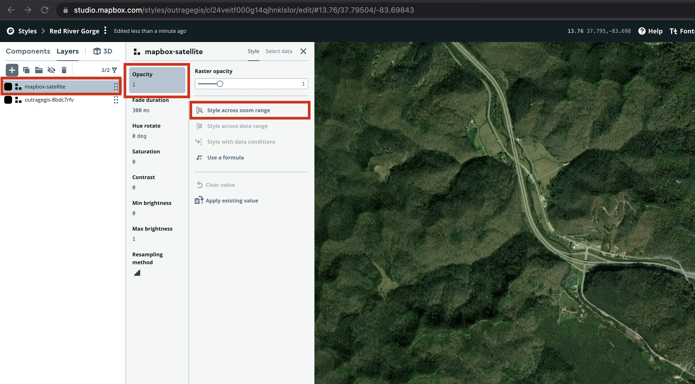 
*Change opacity on zoom range*

Zoom into map where you want to see the satellite image, e.g., zoom level > 14.5. Click **add another stop** to set the opacity level for this zoom level.

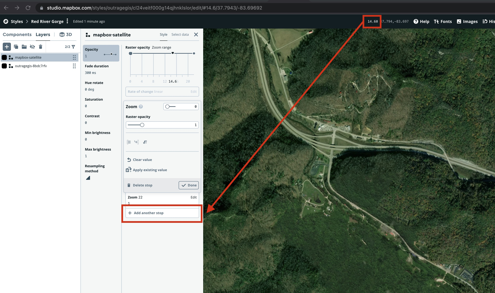 
*Add another stop*

Now, zoom out to where you want to 'turn off' this layer, e.g., 12.5. Click **add another stop** to set the opacity level to 0 for this zoom level.

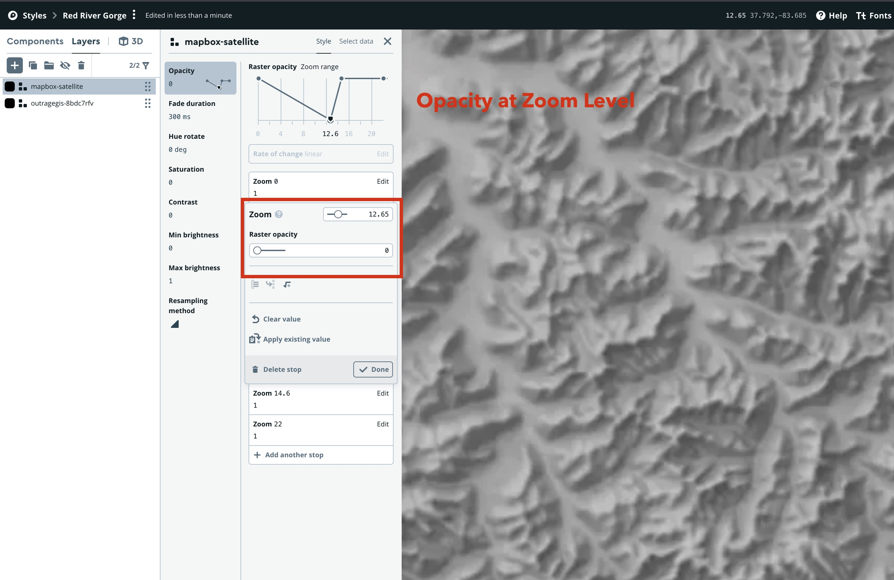 
*Opacity by zoom level*

Finally, click **Edit** for Zoom level 0 and make the raster opacity 0. Now, zoom on your map and observe the custom raster layer appear when we zoom out. Tweak the opacity levels for each Zoom stop to see how it changes.

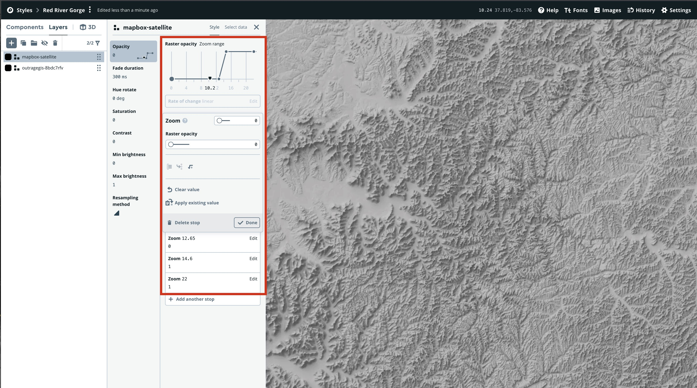 
*Satellite image disappears when zooming out*

Now, add the layers for *waterway* and *water* from the Mapbox Streets V8 tileset to the map. You'll need to do each separately.

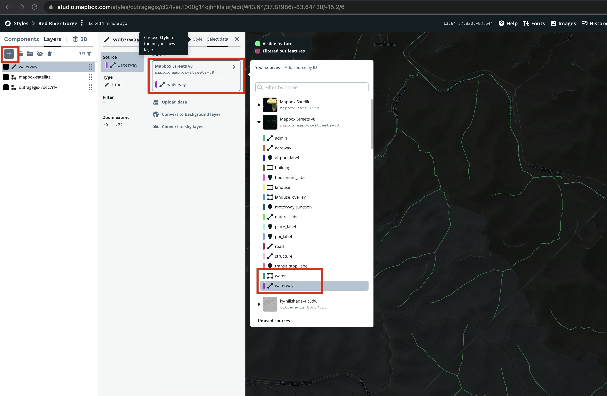 
*add waterway and water*

Style their color properties accordingly.

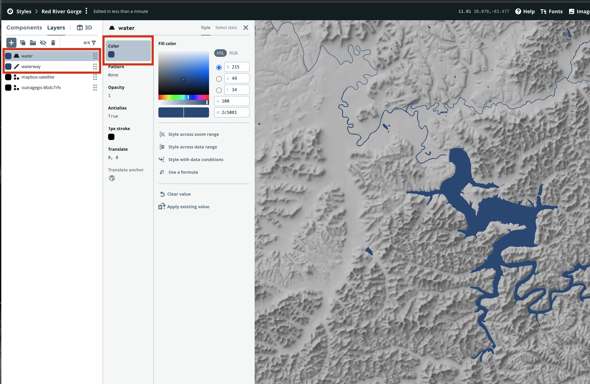 
*Styling waterway and water*

#### Enabling the 3D terrain feature

In Fall 2020, Mapbox release version 2.0 of its GL JS library with support for 3D views. The results are impressive. To enable the feature on your map, press the **3d** menu item and toggle **Enable 3D Terrain** on and add some vertical Exaggeration. 

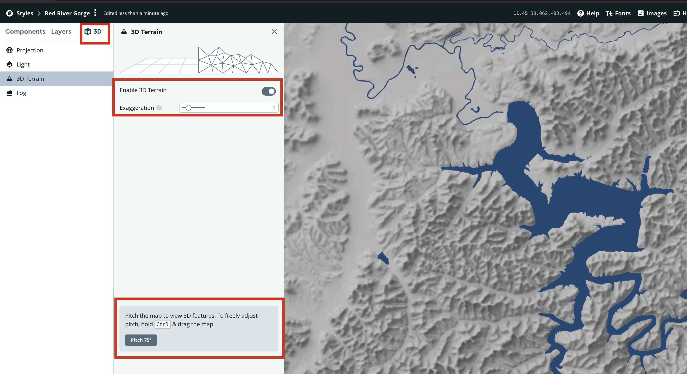 
*Enable 3D in Mapbox*

Click and hold the `Ctrl` button with a mouse left-click, or just right-click, while dragging the map to change the pitch and bearing of your map. 

Now, let's add Fog and change its color.

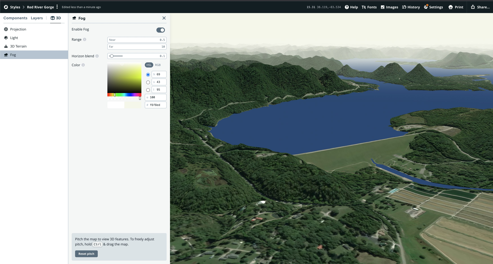 
*Enable Fog in Mapbox*

Let's tweak the opacity of our water layers to reduce opacity when we zoom in, to show details of lake surfaces.

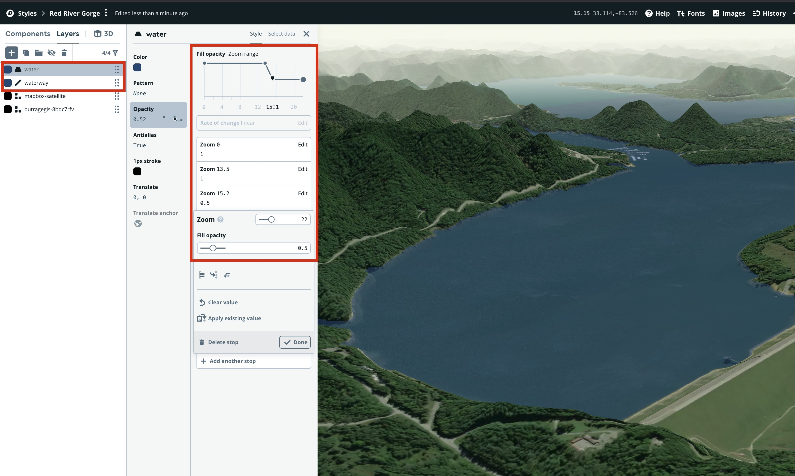 
*Tweak layers at different zoom levels*

Finally, we'll add another custom layer from the previous module: WKU's campus shaded relief with above-ground features and vegetation. Add the tileset to the map, just like the ky-hillshade.tif layer and click **Settings** > **Default map position Lock toggle** to unlock the default map position. Click the lock again to recenter the map on the desired layer.

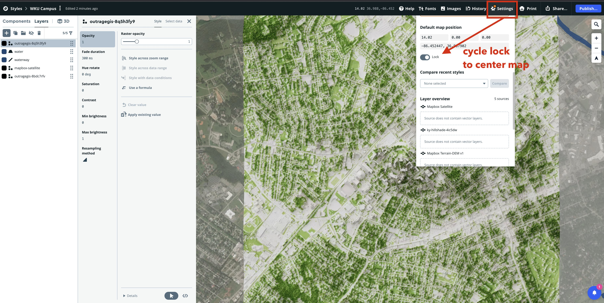 
*Recenter map to new layer*

Now, you have a custom base map for Kentucky! Feel free to add additional layers and tilesets to customize your map. The next sections show how to add elevation contours and points to our map. If you are satisfied with your map, jump down to the [Sharing your map](#sharing-your-map) section to share it with others.

#### Add custom vector layers

While the OSM data is pretty good, we have a couple of issues with our scale of mapping. The OSM data Mapbox uses doesn't have as many arches, and the contour interval is in meters. 

Let's add two layers, aka tilesets, to Studio. We will adjust their appearance as we zoom into our area of interest.

* Arches layer added as a dataset in case we need to edit the layer.
* Contour layer added as a tileset.

#### Add arches layer

Open Mapbox Studio and select **Dataset**. Upload your *arches_us.geojson* and **Confirm**:

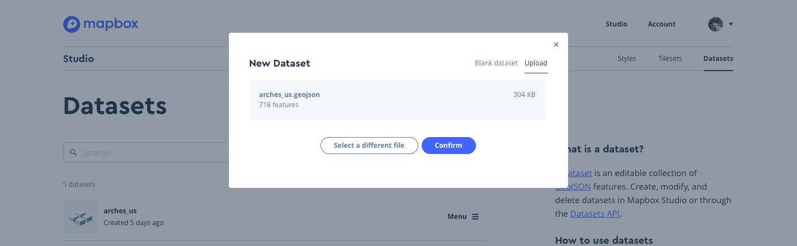 
*Upload new dataset*

After a successful upload, you should find the Dataset editor. This will allow you to change the location of features, add/delete features, and alter attributes. After you visit your location, you can add interesting discoveries to this dataset or move your arch to its correct location.

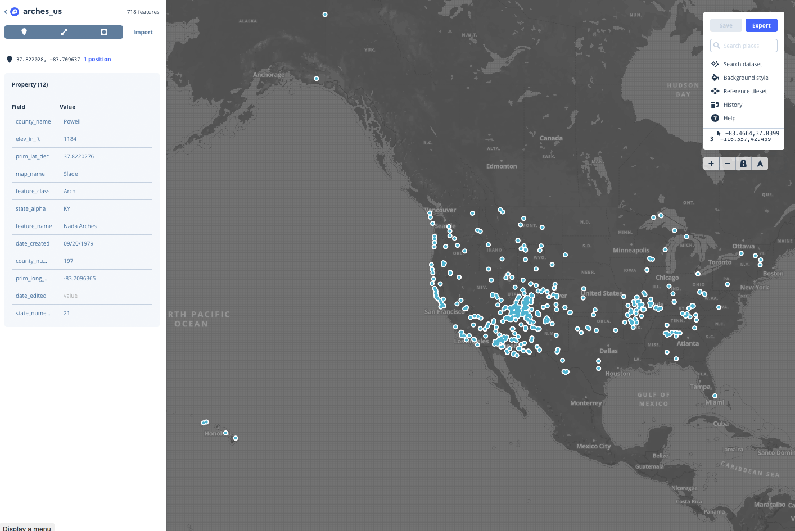 
*Dataset editor*

After you finish editing the dataset, you will need to convert it to a tileset in order to use it in a style. Click on **Tilesets** and find **New Tileset** button. Click on that, and select **Create from dataset**:

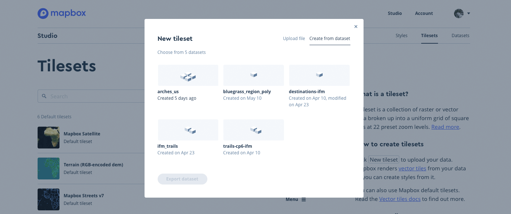 
*Add new tileset from dataset*

After the conversion, verify that you can see the new tileset listed and available for use in a style.

#### Add contour layer

Since datasets cannot be over 5 MB when they're hosted in Studio, we need to upload larger datasets directly as tilesets. If we need to edit larger files, then we need to do it locally and simply replace the old tileset. Create a **New tileset** and upload either of your area of interest or *natbridge-contour_10ft.zip*:

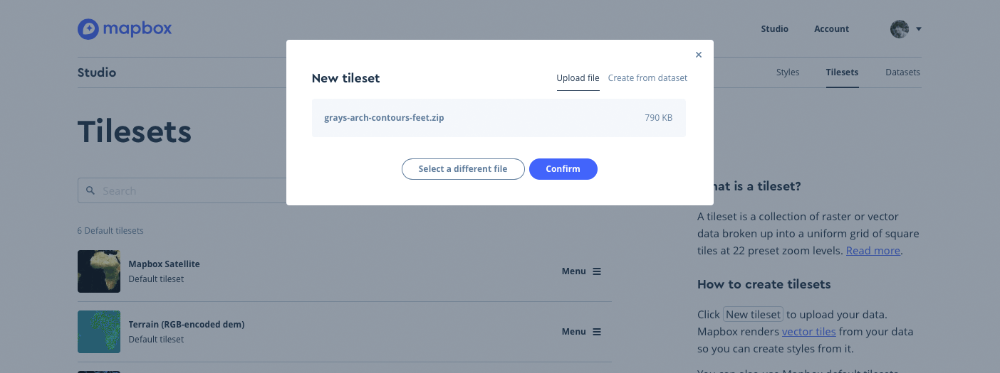 
*Add new tileset from upload*

Again, verify that you have a new tileset (it might take a while to process).


#### Add and symbolize the contour layer

While Mapbox has a contour layer in a Terrain tileset, the detail was not as good as what could be made with our lidar data and ArcGIS Pro. In addition, Mapbox contours are in metric units. Mapbox is becoming much more sophisticated, but it's good to learn how to make custom contours.

Click **Add Layer** icon and search the unused sources for your layer.

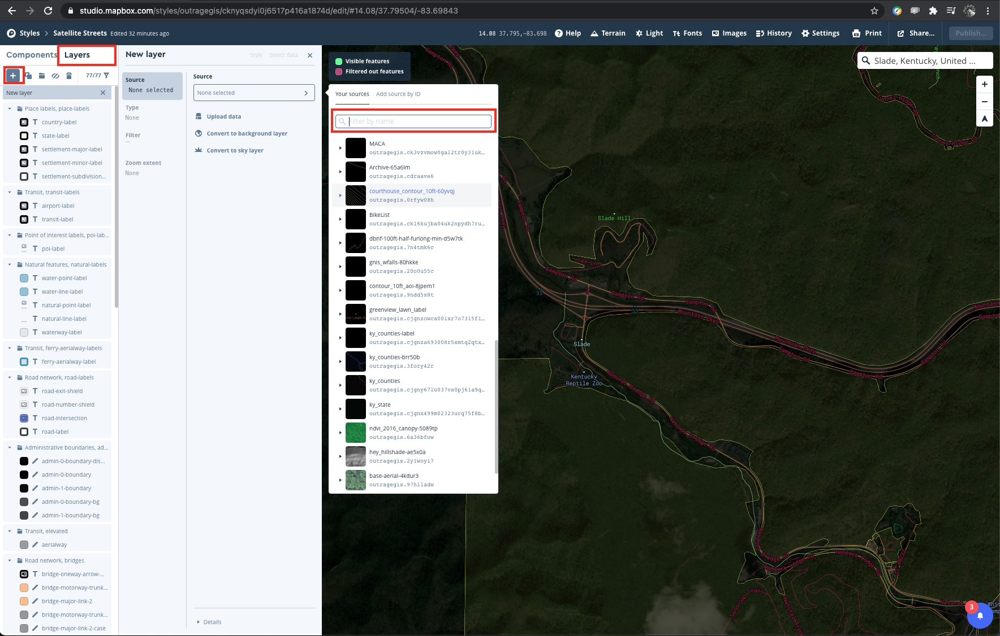 
*Add contours*

Select the zipped Shapefile that uploaded earlier, either of your area of interest or *natbridge-contour_10ft.zip*. Then, select the geometry type that you would like to use, e.g., lines.

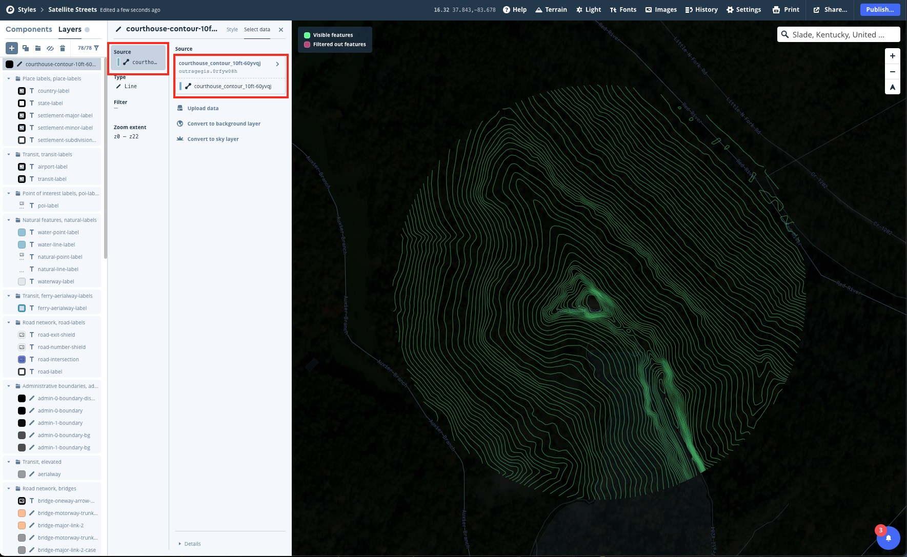 
*Select geometry type*

Select **Style** and then the **Color** properties tab and make the contours white with an opacity of 70.

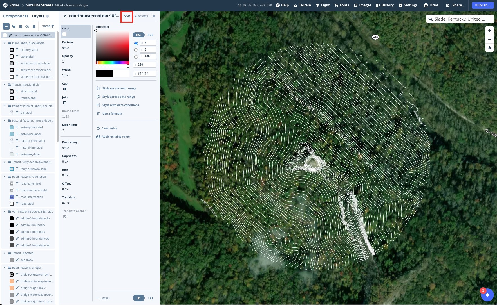 
*Changing color of contours*

Now let's make them disappear when we zoom out. Notice the command palate tells the current zoom level. At zoom level 14, we want to make the zoom opacity property to be 1. At 13.5, we want to make the opacity 0. Click **Opacity tab > Style across zoom range** and change the zoom levels and opacity settings.

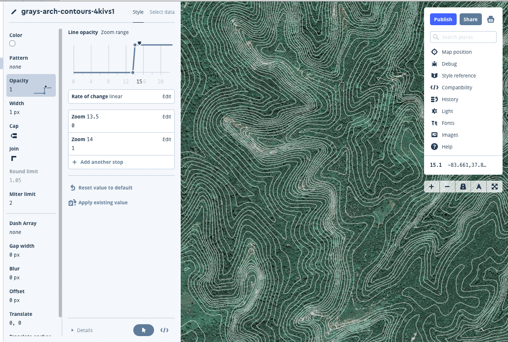 
*Style across zoom range*

The goal is to make the contours disappear before we see the edges of our site map. This helps the user stay focused at a high zoom level in the presented site.

 
*Keep user at high zoom level in the presented site*

Depending on the range of your contour values, you'll need to add an index contour, a thicker line at a regular interval. First, edit the line symbol for all contours. Make them transparent, very thin, and appear at high zoom levels. 

Let's symbolize the index contours and alter the **Width** property using the **Style with data conditions**. Select the **index** field and assign higher widths for index contours.

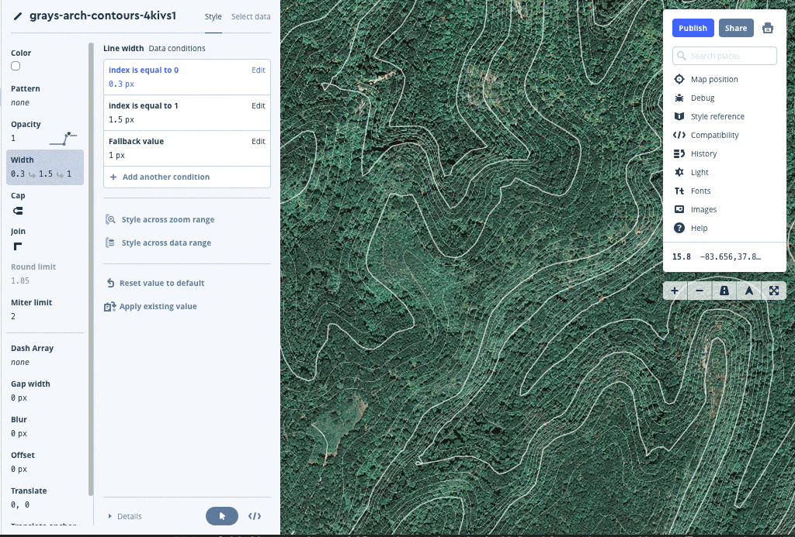 
*Symbolize index contours*

#### Adding text to index contour feature

Duplicate the contour layer, and use **Select Data** to change layer **Type** to **Symbol**. This accesses the labeling engine in Mapbox.

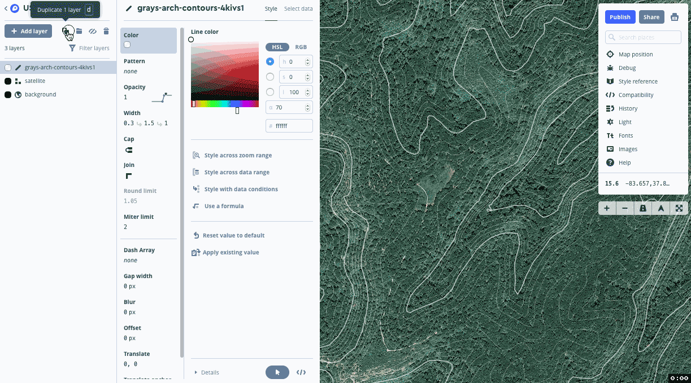 
*Add symbol layer to access labeling*

Once the layer is added, you need to add the **Text field** property, change the text size, color, etc. and add some **Halo** effects to help read the text. Next, click on the **Placement** tab and change the **Placement** property to label on the line. Studio will try to find the best location in your view to drop the label.

To label the index contour, select the **Select data > Filter** tab and add a filter to select only those contours you ant to label.

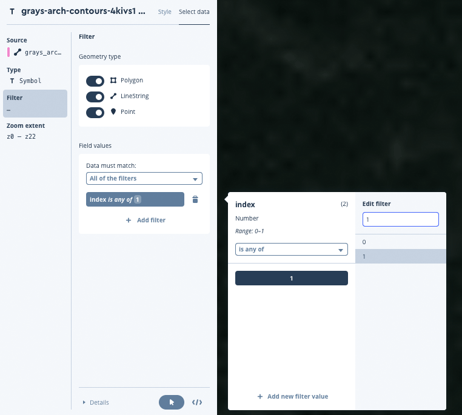 
*Label only index contours by using Select data > Filter*

As you label your features, consider having them appear at very high zoom levels. This will help reduce clutter and make it easier to read.

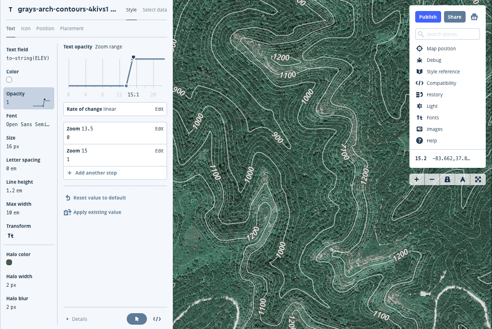 
*Make labels disappear at zoom level 13.5*

#### Add arches layer

Like the steps we just completed to add contours and its label, adding points can be different if we want to add custom icons with labels. Select **arches-us** and change the **Type** to **Symbol**.

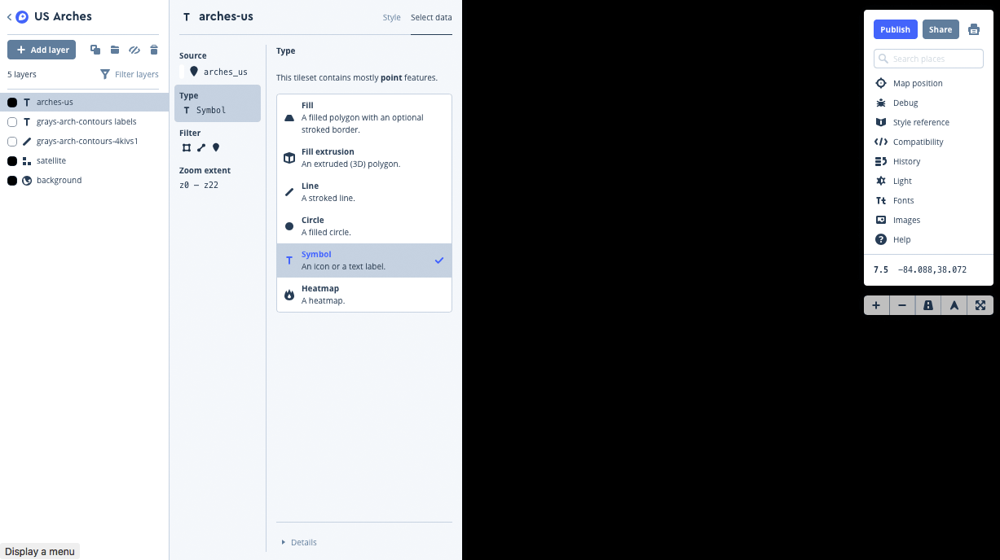 
*Add symbol layer for custom icons*

Let's now add a custom SVG icon for arches. Use the icon found in [*lesson-map/arches.svg*](lesson-map/arches.svg). Then, upload it to the **Command palette > Images** section.

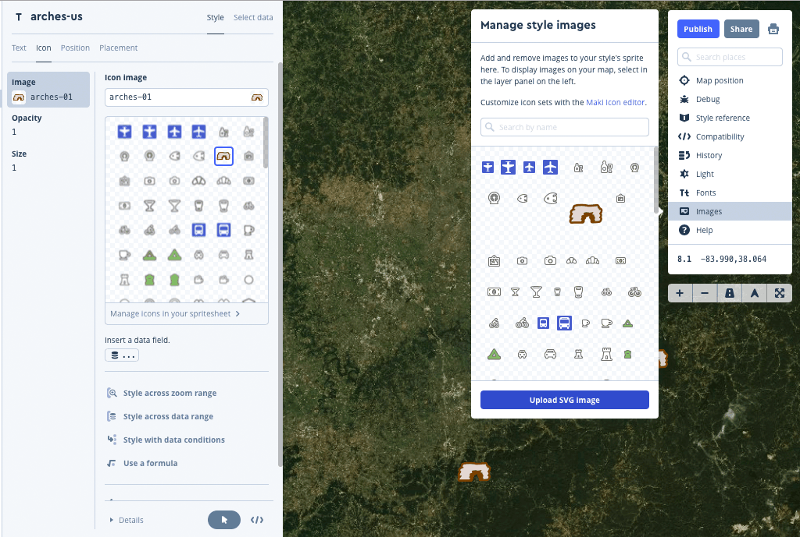 
*Add custom icons*

Style the text color and halo properties and add text offset to move the text off the label. 

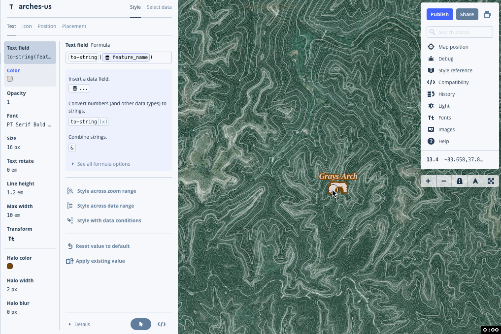 
*Style custom icon labels and text*

Wondering how the color values were selected to match the icon? The SVG format (Scaled Vector Graphics) is a text-based format that we can open in our editor. When we peek into the arches SVG file, we can find the exact colors used.


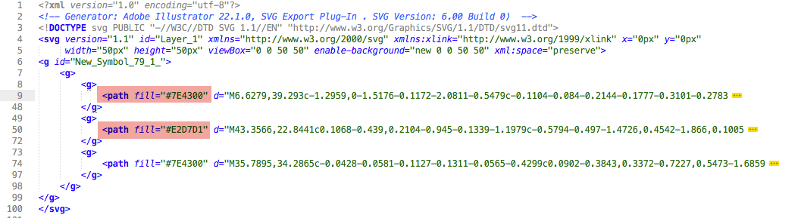 
*Inspect SVG for colors*

The hexadecimal value for the light color is `#E2D7D1` and for the darker color `#7E4300`.


### Sharing your map

When you're ready to finish your map or make a new instance of this style, you **Publish style**. Click on **Publish** for new maps before sharing.


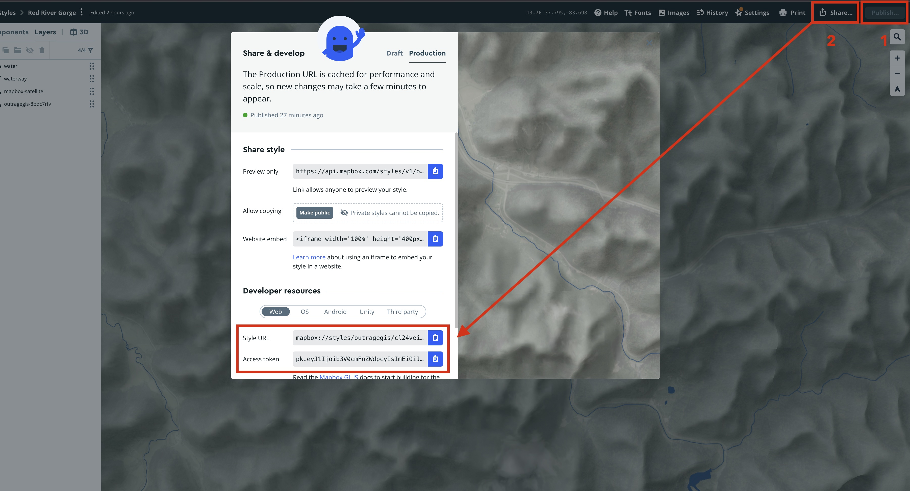 
*Reset map center and zoom level*

A side-by-side comparison will show changes from the last published state. If you like the changes, click **Publish**.

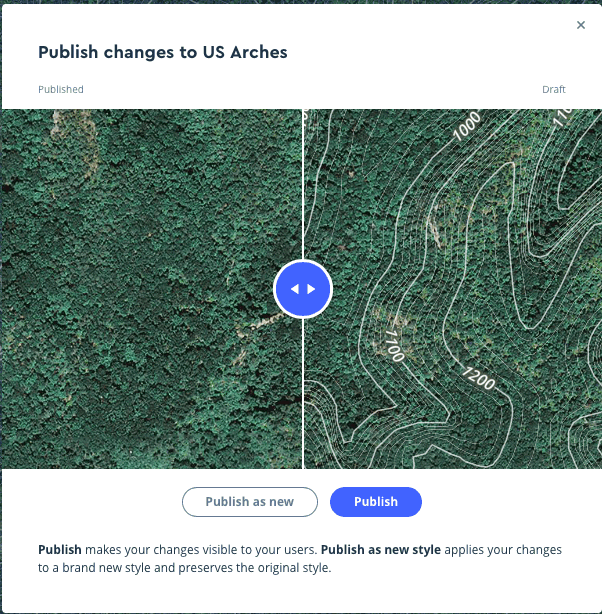  
*Publish map*

This map is now able to be shared. Any changes you make in Studio to the map will require you to publish the changes again. So, you can edit the map without making the changes public until you are ready to publish.

Next, click the **Share** menu item. Get the **Style URL** and **Access token** to use this map on a web page. (You can also find these properties in your Studio [Styles list](https://studio.mapbox.com/); click on the style's menu, and select **Share your style** icon.)

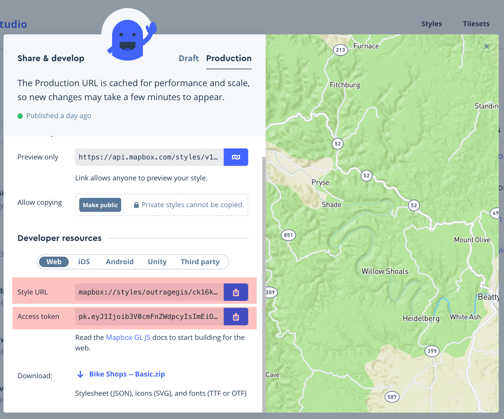  
*Share, develop & use*

Edit the *lesson-map/map.html* HTML document in VS Code. Insert the copied text from **Style URL** and **Access token** properties into the appropriate commented section. Be aware of keeping quotes around the style URL and access token strings.

```html
<!DOCTYPE html>
<html>

<head>
  <meta charset='utf-8' />
  <title>Display a map</title>
  <meta name='viewport' content='initial-scale=1,maximum-scale=1,user-scalable=no' />

  

<script src='https://api.mapbox.com/mapbox-gl-js/v2.8.1/mapbox-gl.js'></script>
<link href='https://api.mapbox.com/mapbox-gl-js/v2.8.1/mapbox-gl.css' rel='stylesheet' />


  <style>
    body {
      margin: 0;
      padding: 0;
    }

    #map {
      position: absolute;
      top: 0;
      bottom: 0;
      width: 100%;
    }
  </style>
</head>

<body>

  <div id='map'></div>

  <script>
    // 💡💡💡 LOOK HERE ---------------------------------
    // 💡💡💡 Change these variables --------------------
    const styleURL = 'mapbox://styles/...'
    const token = 'pk....'
    // ------------------------------------------------
    
    
    mapboxgl.accessToken = token;
    var map = new mapboxgl.Map({
      container: 'map',
      style: styleURL,
      // ------------------------------------------------
      // zoom: 15.65,
      // center: [-83.657662, 37.817418], 
      // pitch: 85,
      // bearing: 80
      // ------------------------------------------------

    });

    // Add geolocate control to the map.
    map.addControl(new mapboxgl.GeolocateControl({
      positionOptions: {
        enableHighAccuracy: true
      },
      trackUserLocation: true
    }));
  </script>

</body>

</html>
```

Save this file in VS Code. Open the *lesson-map/index.html* file and click on VS Code's **Go Live** button to view the map in your browser.


### Adding other tilesets to your Mapbox map

Let's say you wanted to added terrain data or state outlines to your map. You **Add Layer** as normal and pick one of the global tilesets that Mapbox has created. Let's add the *Terrain (RGB-encoded dem)* from our *Unused sources*. 

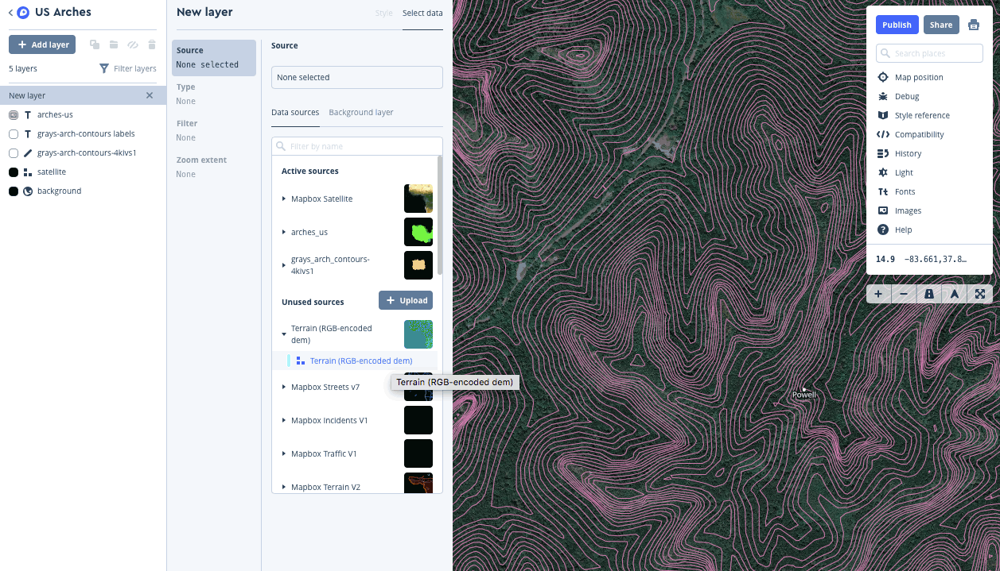 
*Add Terrain tileset*

Re-order the layers by moving the Mapbox-terrain layer to just above the satellite layer.

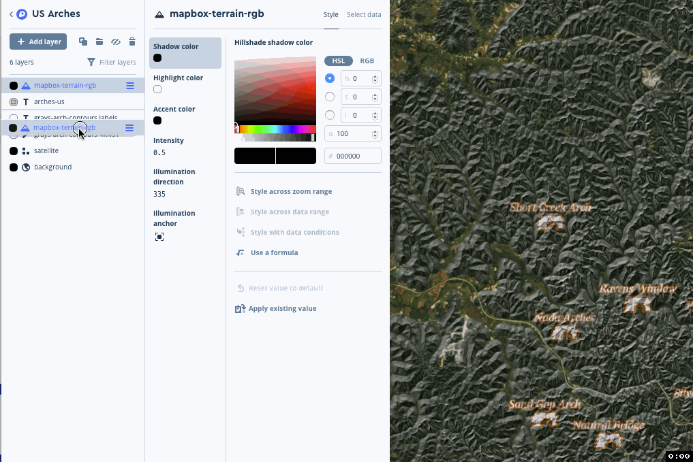 
*Add Terrain tileset*

Finally, adjust the *Intensity* values and *Style across zoom range* to fade the layer out when we zoom into the site.

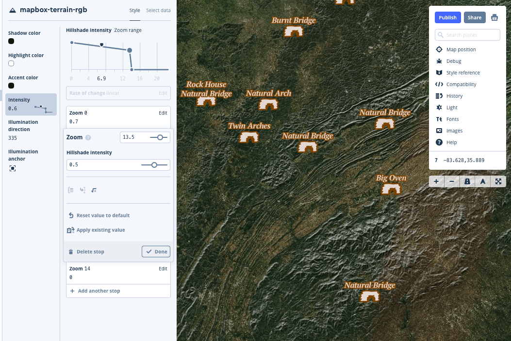 
*Style across zoom range settings*


### GeoJSON format

The GeoJSON (geographic JavaScript object notation) is [format](http://geojson.org) adopted in 2008 and modified in 2016. The format standardizes the encoding of human-readable geographic data structures and is widely used in open-source web mapping applications. ArcGIS Pro can [convert GeoJSONs to feature classes](http://pro.arcgis.com/en/pro-app/tool-reference/conversion/json-to-features.htm) and [export to GeoJSON](http://pro.arcgis.com/en/pro-app/tool-reference/conversion/features-to-json.htm). 

The format was created to help share geographic data easier than the Shapefile, a multi-file format that has significant limitations for storing attributes. We use the Shapefile format in this module because it limits the length of lines to 400 vertices. Mapbox has a similar limit, while the GeoJSON has no such constraint.

The GeoJSON is also human-readable, and any code editor can open and edit the file. Your text editor is now a GIS! The format is pretty easy to parse. It is the JavaScript version of a Python Dictionary where you have `key:value` pairs wrapped in curly brackets, `{}`. The standard specifies that coordinates are encoded as `x,y` pairs. That is longitude (x) and latitude (y), a reversal of our common "lat, long" phrase.

```js
{
 "type": "Feature",
 "geometry": {
 "type": "Point",
 "coordinates": [-83.6843, 37.7725]
 },
 "properties": {
 "name": "Natural Bridge",
 "elev": 1280
 }
}
```

A few online tools are helpful in working with GeoJSONs. [geojson.io](http://geojson.io) will convert many formats to GeoJSON. It is a good source to preview files or make new ones. [mapshaper.org](https://mapshaper.org/) will generalize vector layers and export to GeoJSON.

